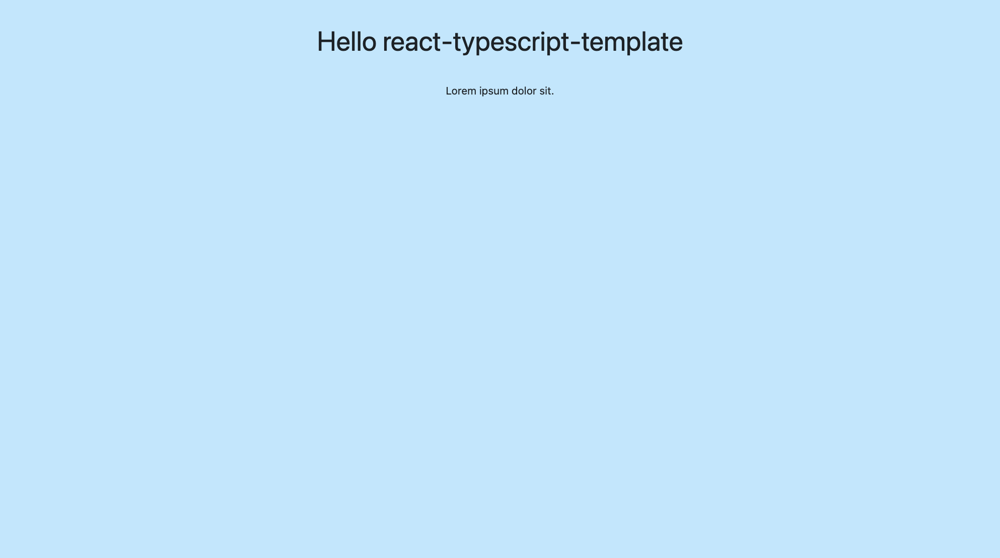

# Template React | react 项目模版

## 技术选型

- [x] react
- [x] typescript
- [x] webpack
- [x] styled-components
- [x] immer
- [x] recoil

其中webpack自定义配置热重载服务器。使用ts-loader只编译成jsx，然后用babel-loader再编译，并使用单独的插件进行类型检查。

## 项目结构

- src
  - asserts：图片资源
  - components：组件
  - hooks：自定义hooks
  - layout：布局框架
  - page：页面
  - App.tsx：引入一些根包裹层
  - cssConfig.ts：css全局变量
  - GlobalStyle.tsx：全局css
  - index.tsx：挂载到dom

